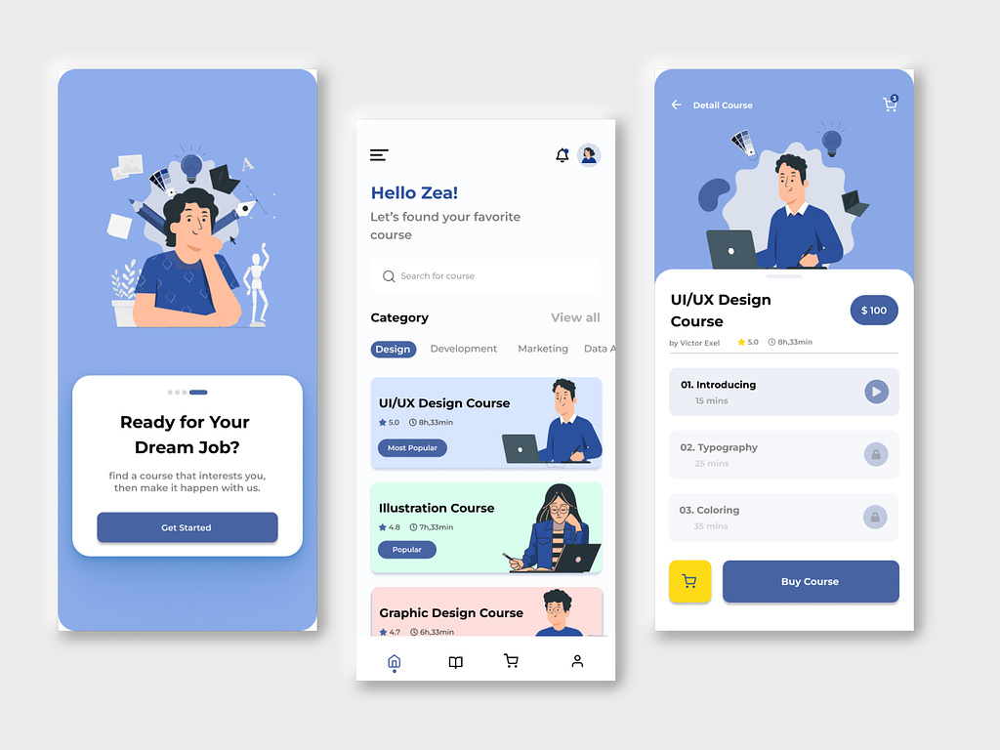
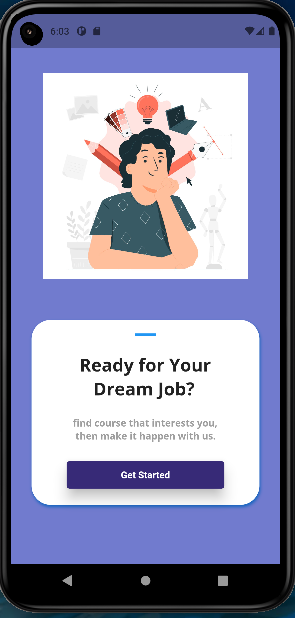
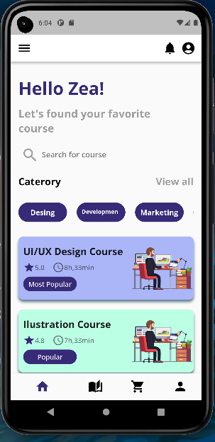
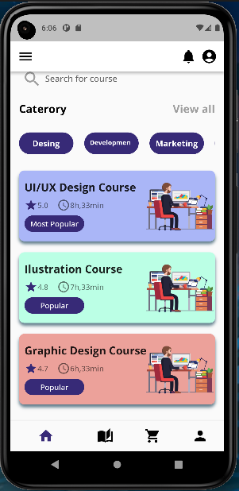
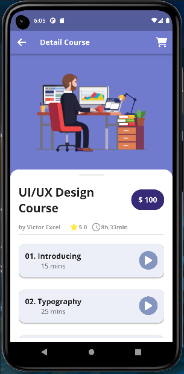
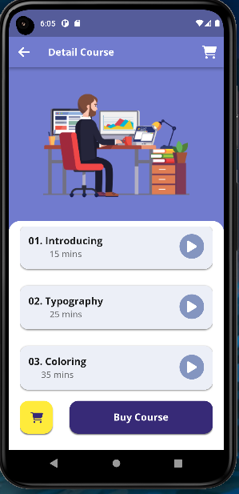

# Cursos App

- Nos últimos dias estive praticando o desenvolvimento de apps mobile com Flutter, depois de algum tempo.

- Para este projeto peguei um design no site dribbble para praticar minhas habilidades.

- Na ocasião escolhi este design do app [Courses App](https://dribbble.com/shots/21527969-Online-Course-Mobile-App).

## Telas Criadas

- **Tela inicial:**

- **Tela Home:**

    |   

- **Tela Detalhes:**

   |  